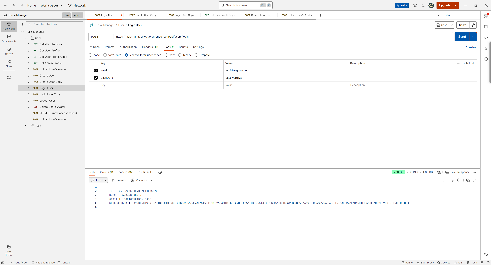
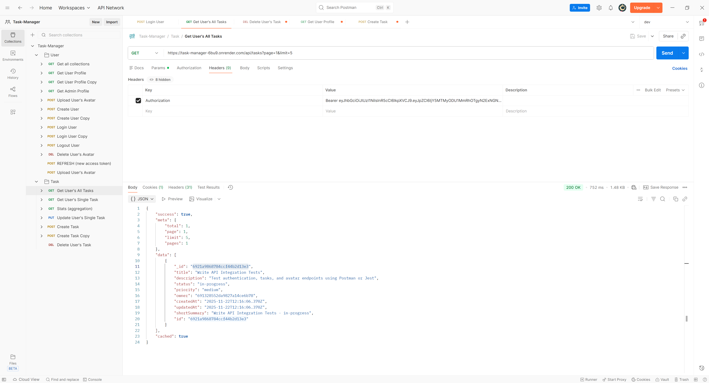
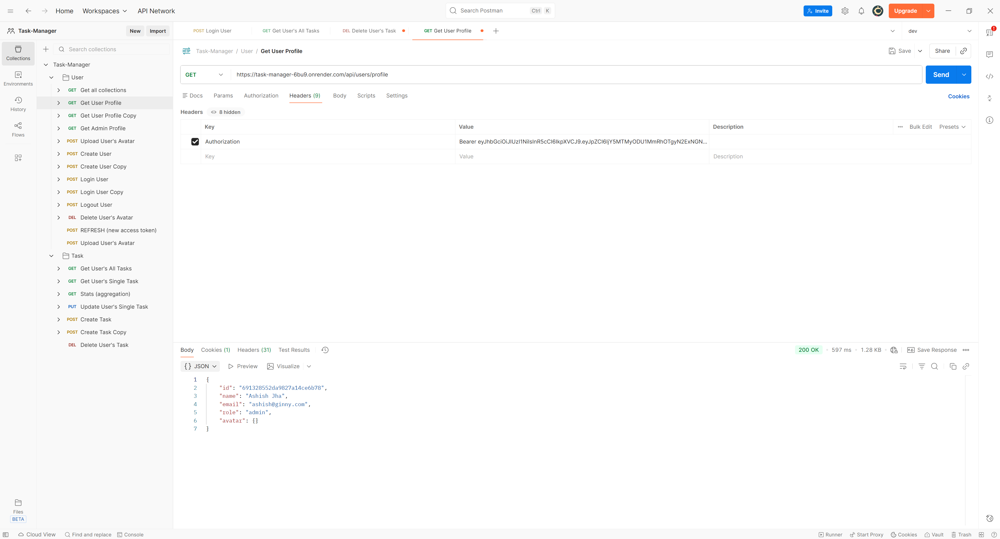
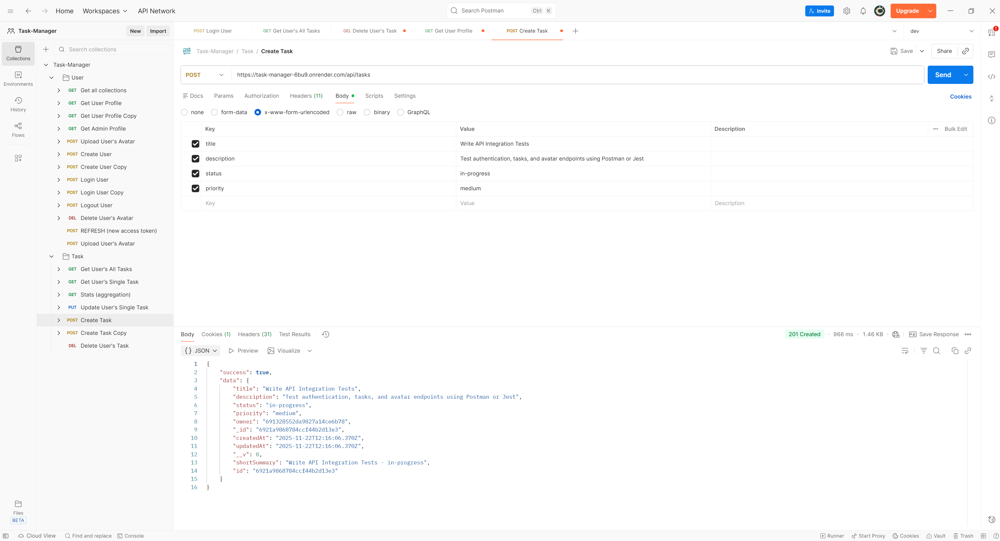
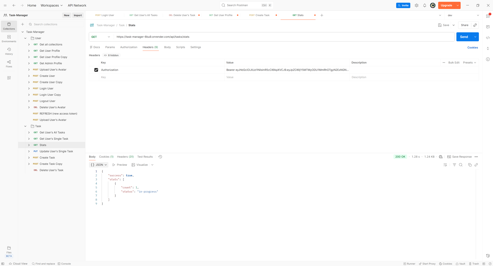
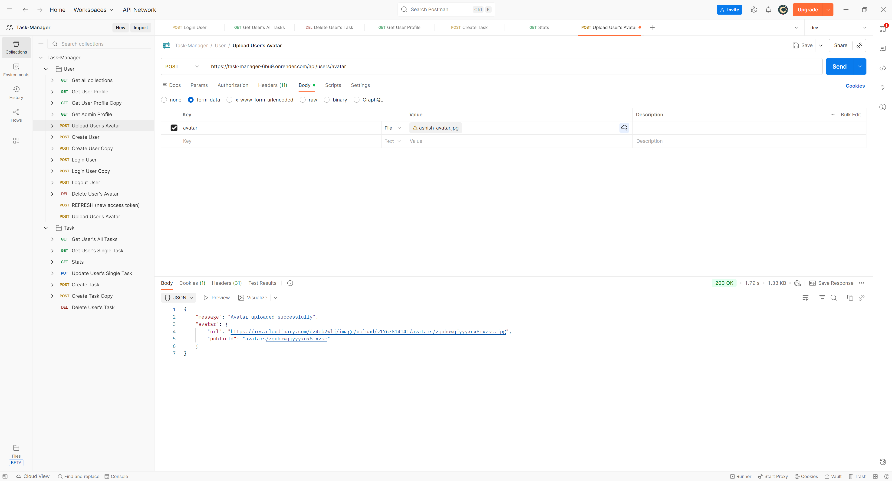

<div align="center">

# 🚀 **TASK MANAGER API**
### **Production-grade backend engineered for real-world scalability**

✨━━━━━━━━━━━━━━━━━━━  **❖**  ━━━━━━━━━━━━━━━━━━━✨
</div>

---

## ⚡ **Quick Features Summary**

✔ JWT Auth (Access + Refresh Tokens)  
✔ Admin + User Roles  
✔ Task CRUD with Pagination & Filters  
✔ Aggregation-based Task Stats  
✔ Redis Caching (Tasks + Stats)  
✔ Cloudinary Avatar Uploads  
✔ Production Security Middleware  
✔ Winston Logging + Central Error Handler  
✔ Clean Controller-Service Architecture  

---

## 🧰 **Tech Stack**


---

## 🎯 **Tech Highlights (Why This Backend is Production-Ready)**

- **JWT Access + Refresh token architecture** with httpOnly cookies  
- **DB-stored refresh tokens** enabling session revocation  
- **Redis caching layer** for high-performance task retrieval  
- **Cloudinary `upload_stream`** for optimized avatar upload  
- **MongoDB Aggregation** for task analytics  
- **Winston logger + Morgan logs** for observability  
- **Rate limit, sanitize, XSS, helmet** for enterprise security  
- **Virtual populate** linking Users ↔ Tasks  
- **Clean modular folder structure** (scalable engineering pattern)

---

## 🌐 **Live Demo**
🔗 **API URL:** https://task-manager-6bu9.onrender.com  
📁 **GitHub Repo:** https://github.com/Ashishjha013/task-manager-api

---

## 📸 **Screenshots**

### 🔐 Login


### 📝 Tasks Cached


### 👤 Profile


### 📝 Create Task


### 📊 Stats


### 🖼 Avatar Upload


---

## 🔥 **Features (Detailed)**

### 🔐 Authentication & Authorization
- Register / Login / Logout  
- Access + Refresh token lifecycle  
- Refresh tokens stored in DB for session revocation  
- Role-based access  
- Secure httpOnly cookies  

---

### 📝 Task Management
- CRUD operations  
- Search, filter, sort  
- Pagination  
- Stats endpoint using MongoDB aggregation  
- Owner-based access control  
- Admin access to all tasks  

---

### ⚡ Redis Caching
- Cache heavy `GET /tasks` API  
- Cache stats endpoint  
- Auto invalidation on task create/update/delete  
- Query-aware cache keys  

---

### ☁️ Cloud Features
- Multer (memoryStorage)  
- Cloudinary upload_stream for avatars  
- Auto delete old images  

---

### 🛡 Security
- Helmet  
- Rate limiting  
- CORS  
- express-mongo-sanitize  
- xss-clean  
- HttpOnly secure cookies  

---

### 📊 Observability
- Winston structured logs  
- Morgan request logs  
- Central error handler  
- Async handler wrapper  

---

## 🧱 **API Endpoints**

### Auth
| Method | Endpoint |
|--------|----------|
| POST | `/api/users/register` |
| POST | `/api/users/login` |
| POST | `/api/users/refresh` |
| POST | `/api/users/logout` |
| GET | `/api/users/profile` |
| POST | `/api/users/avatar` |
| DELETE | `/api/users/avatar` |

### Tasks
| Method | Endpoint |
|--------|----------|
| POST | `/api/tasks` |
| GET | `/api/tasks` |
| GET | `/api/tasks/stats` |
| GET | `/api/tasks/:id` |
| PUT | `/api/tasks/:id` |
| DELETE | `/api/tasks/:id` |

---

## 🧪 **Sample API Response**

```json
{
  "task": {
    "title": "Complete Backend Project",
    "description": "Finish API endpoints and caching",
    "priority": "High",
    "status": "Pending",
    "owner": "674d1fbe9c8f123abc45ef90"
  }
}


---

## 🏗 High-Level Architecture

```
[Client]
   |
   v
HTTPS
   |
[Express Server]
   ├── Auth Layer (JWT)
   ├── Task Layer
   ├── File Upload Layer
   ├── Redis Cache
   ├── MongoDB Atlas
   └── Cloudinary
        |
   Winston + Morgan Logs
```

---

## 📡 Core Endpoints

### Auth
- POST `/api/users/register`
- POST `/api/users/login`
- POST `/api/users/refresh`
- POST `/api/users/logout`
- GET `/api/users/profile`
- GET `/api/users/admin`

### Tasks
- POST `/api/tasks`
- GET `/api/tasks`
- GET `/api/tasks/stats`
- GET `/api/tasks/:id`
- PUT `/api/tasks/:id`
- DELETE `/api/tasks/:id`

### Avatar
- POST `/api/users/avatar`
- DELETE `/api/users/avatar`

---

## ⚡ Quick Start (Local)

### 1️⃣ Clone
```bash
git clone https://github.com/Ashishjha013/Task-Manager.git
cd Task-Manager
```

### 2️⃣ Install
```bash
npm install
```

### 3️⃣ Environment Variables

```
PORT=8080
NODE_ENV=development

MONGO_URI=your_mongodb_atlas_uri

JWT_ACCESS_SECRET=your_secret
JWT_REFRESH_SECRET=your_refresh_secret

CLOUDINARY_CLOUD_NAME=...
CLOUDINARY_API_KEY=...
CLOUDINARY_API_SECRET=...

REDIS_URL=your_redis_url
REDIS_TTL_SECONDS=300

FRONTEND_URL=http://localhost:3000
```

### 4️⃣ Run
```bash
npm run dev
```

---

## 🌐 Production Smoke Test

1. Register  
2. Login  
3. Hit `/profile`  
4. Create task  
5. List tasks → validate **cached**: true  
6. Hit `/stats`  
7. Upload avatar  

---

## 🎯 Engineering Rationale

- Access tokens protect short sessions  
- Refresh tokens allow session renewal without relogin  
- DB-stored refresh tokens allow revocation  
- Redis reduces DB load and improves response latency  
- Cloudinary avoids binary storage in your DB  
- Compound Mongo indexes improve query performance  
- Centralized error handler guarantees consistent DX  

---

## ✨ Author
**Ashish Kumar Jha**  
📍 India | 💻 Backend Engineer

---

## 📬 Connect with Me

- 🔗 GitHub: [Ashishjha013](https://github.com/Ashishjha013)
- 💼 LinkedIn: [Ashish Jha](https://www.linkedin.com/in/ashishjha13/)
- 📧 Email: [ashishjha1304@gmail.com](mailto:ashishjha1304@gmail.com)

---

## ✍️ Contribution & License

Feel free to fork and open PRs. Add clear unit/integration tests for controllers.

---

*Generated for: Ashish Jha — Task Manager*


